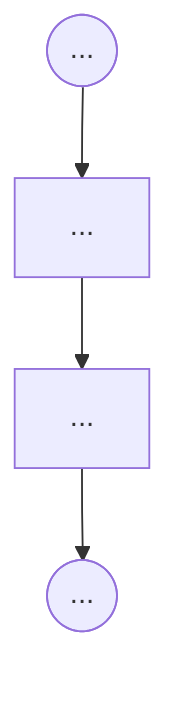

# FLOW.md — AI Livestream Hub

> Navigation structure, screen relationships, 
> We'll use this as the authoriative source of truth for UI/UX flow in our web app. 
> We consolidate this as a markdown file in our repo so that it is agent-friendly. 

---

## 1. Navigation hierarchy

> Every user-facing screen, indented by nav depth. We plan to use a hierarchical navigation system reflecting the sequential depth-based structure of our standard user workflow. User navigation from one screen to the other is determined by what screens are directly above / below it in depth. 


```
- Dashboard
  - ...
  - ...
- Settings
  - ...
```

---

## 2. Screen relationships

> Single Mermaid graph with every page-to-page navigation edge.
> Use subgraph blocks to group related screens.
> Label edges only when the nav type is non-obvious.

```mermaid
flowchart LR
  subgraph Core
    Dashboard --> ScreenA
    ScreenA --> ScreenB
  end

  subgraph Settings
    Settings --> SettingsChild
  end

  Dashboard --> Settings
```


---

## 3. Key user journeys

>  One small flowchart per critical path.

### Journey: Going live




